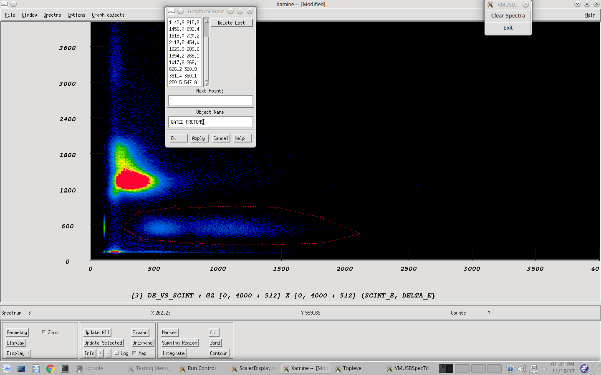
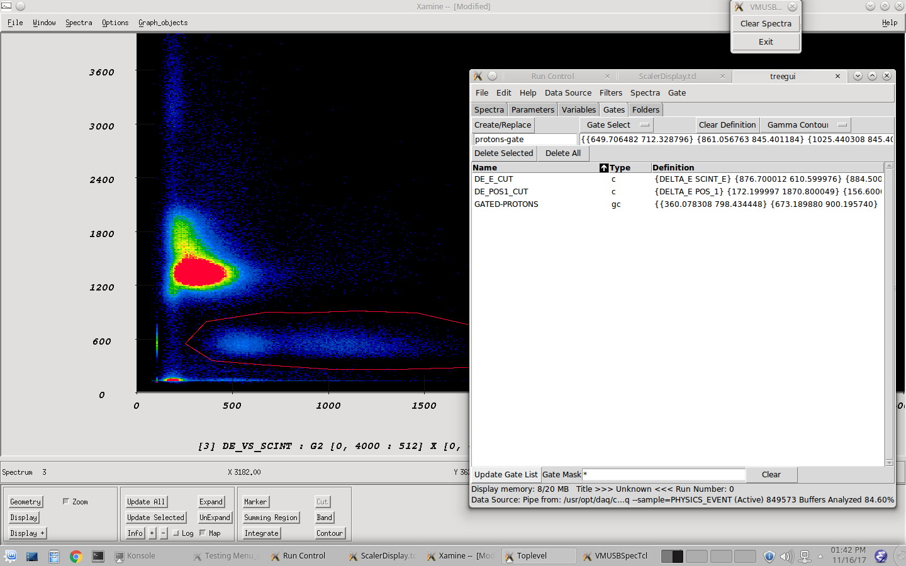
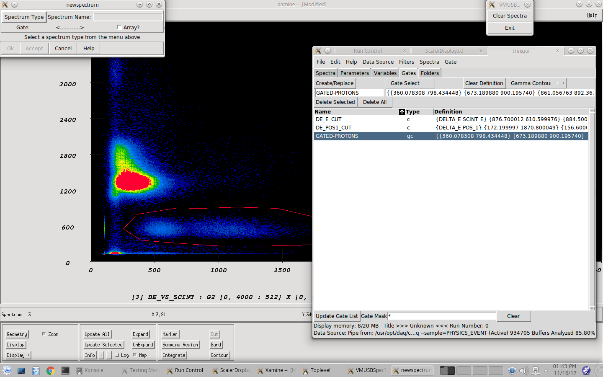
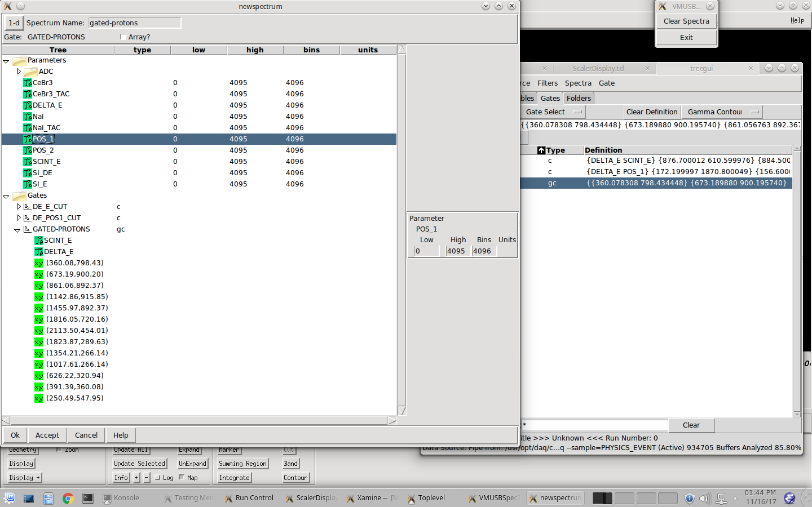

<h2>Table of Contents</h2>

<ul>
<li><a href="#org655e211">1. Setting live gates</a></li>
</ul>

# Setting live gates

1.  Select the 2D spectrum you want to make the gate on

2.  Graph Objects -> Add -> Contour

3.  Enter a name for the contour

4.  Click on the region for the gate, click "OK"

    

5.  

    

    
    

    
    

