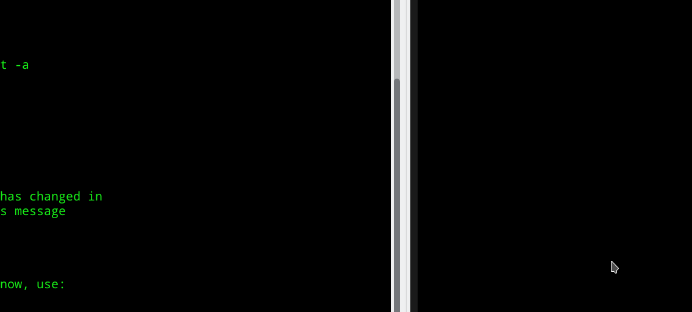

<h2>Table of Contents</h2>

<ul>
<li><a href="#org40f1fc1">1. Setting live gates</a>
<ul>
<li><a href="#orgd6d47ae">1.1. Select the 2D spectrum you want to make the gate on</a></li>
</ul>
</li>
</ul>

# Setting live gates

## Select the 2D spectrum you want to make the gate on

[Test Image](TestImage.png)

